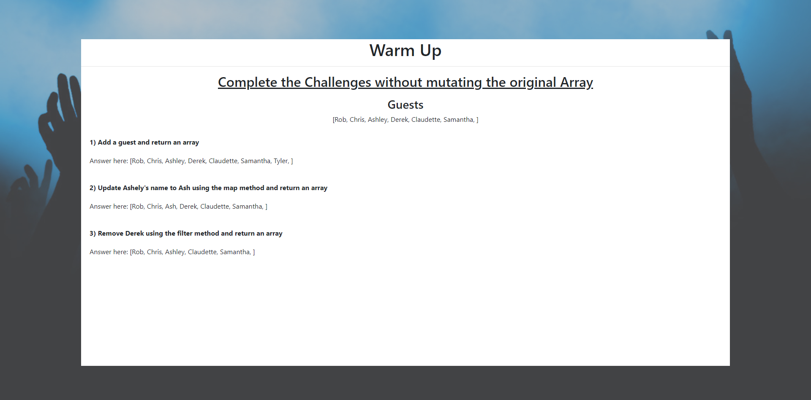

# CRUD Lab

## Environment Setup

### Backend
cd into `crud-basics-backend`

run the following commands in the terminal:
*  `rails bundle install`
*  `rails db:migrate`
*  `rails db:seed`
*  `rails s`

### Frontend
cd into `crud-basics-frontend`

run the following commands in the terminal:
*  `npm install`
*  `npm start`

## Warm up

Switch to warmup branch: `git checkout warmup`

The purpose of the warmup is to simulate manipulating state using the **spread operator** `...`

Solution found in the warmup-solution branch
### Challenges
1) Add a guest and return an array

2) Update Ashely's name to Ash using the map method and return an array

3) Remove Derek using the filter method and return an array

***hint*** - use the premade `this.printGuest()` function 

## Main

Switch to main branch: `git checkout main`

The majority of this application is built out. Use the concepts reviewed in the warm up to complete the following deliverables.

Solution found in the solution branch
### Deliverables 

* Add user using the Add User Form
* Update user using the Update User Form
* Delete a user
* Display the respective number of guests in 'The Break Down'
